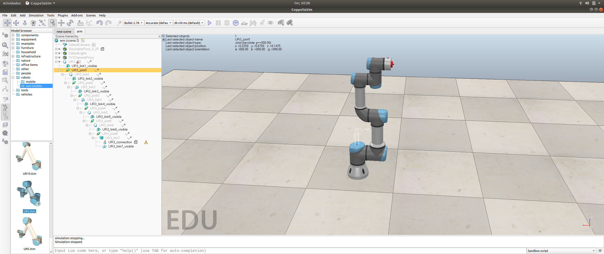

# UR3-CoppeliaSim-API
> API for simple use of UR3 manipulator on CoppeliaSim simulator with Python remote API

To make it easier to start using simulations APIs can leverage the development.



The main code in this repository is ur3_api.py that contains all abstraction elements of CoppeliaSim. This file implements the UR3 class, so to use it in your application add the file to the same directory of your code and add to your code:

```python
from ur3_api import UR3
```

At the moment the API just counts with 3 methods:

run_coppelia() - Start all Coppelia functionalities

joint_values(thetas) - Send joint position values to the Robot, receive has input an list with 6 values in radians 

stop_simulation() - Ends all Coppelia functionalities

## Remote API files

The code was developed in Ubuntu 18.04, if you are using other OS you need to change the remoteApi.so file to the appropriate remote API library: "remoteApi.dll" (Windows), "remoteApi.dylib" (Mac) or "remoteApi.so" (Linux)

## Steps with Coppelia

1. Execute Coppelia
2. Add UR3 to the scene in the non-mobile robots sector
3. Disable UR3 native script
4. Add an threaded child script in some object in the scene
5. Add "simRemoteApi.start(19999)" in the initialization area of the child script
6. Run the simulation, and after it the python code 
